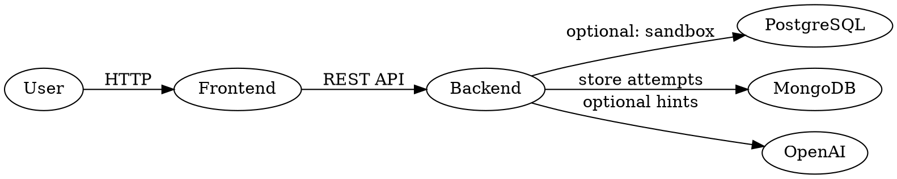

# CipherSQLStudio 🔐🧩

**CipherSQLStudio** is a lightweight SQL learning sandbox with a React frontend and a mock Node.js backend for running safe SELECT-only SQL exercises. This repo includes an optional PostgreSQL/MongoDB docker stack and a small API that serves assignment data and executes mock queries.

---

## Table of contents
- ➤ Project overview
- ➤ Getting started (commands)
- ➤ Environment variables (`backend/.env.example`)
- ➤ Dependencies
- ➤ Project structure
- ➤ Development & production workflows
- ➤ DFD diagrams (Mermaid + DOT)
- ➤ Contributing & License

---

## Project overview ✨
CipherSQLStudio provides:
- A React-based UI to attempt SQL assignments and run SQL queries in a safe sandbox.
- A Node.js mock backend (`backend/server.js`) that validates queries and returns simulated results.
- Optional Docker Compose that can spin up PostgreSQL and Mongo (for when you want a full DB-backed environment).

---

## Quick start — commands to run 🚀

Prerequisites:
- Node.js >= 18 and npm (or yarn)
- Docker & Docker Compose (optional, for DB services)

Clone:
```bash
git clone <repo-url>
cd ciphersqlstudio
```

Option A — Run locally (fast; uses mock backend):
```bash
# Backend
cd backend
npm install
# starts the mock API at http://localhost:5000
npm run dev

# Frontend (in new terminal)
cd ../frontend
npm install
npm start
# React app runs at http://localhost:3000
```

Option B — Run with Docker Compose (start DBs; backend still uses mock behavior but DBs available):
```bash
# from repo root
docker compose up -d
# Start backend & frontend as above (they will be able to connect to the DBs if configured)
```

Build for production:
```bash
# Frontend
cd frontend
npm run build

# Backend (production)
cd ../backend
NODE_ENV=production npm start
```

Helpful API endpoints:
- Health: GET http://localhost:5000/api/health
- Assignments: GET http://localhost:5000/api/assignments
- Execute SQL (POST): POST http://localhost:5000/api/execute

---

## Environment variables (samples) 💡

Create `backend/.env` (copy from `backend/.env.example`) and set values.

Note: The mock server does not require DB or OpenAI keys to run; these are for optional integrations.

> ⚠️ Keep secrets out of git. Use `.env` and add to `.gitignore`.

---

## Dependencies 📦

Backend (`backend/package.json`):
- express ^4.18.2
- cors ^2.8.5
- dotenv ^16.3.1
- devDependency: nodemon ^3.0.1

Frontend (`frontend/package.json`):
- react ^19.x
- react-dom ^19.x
- react-router-dom ^7.x
- react-scripts 5.0.1
- axios ^1.13.x
- @monaco-editor/react ^4.7.0
- devDependency: sass ^1.97.x

Docker services (optional):
- postgres:15
- mongo:6

---

## Project structure 🔧
Key files & folders:
- `backend/` — mock API, server logic, seed scripts, config
  - `server.js` — mock endpoints & query executor
  - `config/database.js` — optional Postgres/Mongo connection
  - `.env.example`
- `frontend/` — React app
  - `src/pages/AssignmentAttempt/AssignmentAttempt.js` — main attempt UI
  - `src/components` — editor, hints, results UI
- `docker-compose.yml` — launches PostgreSQL and Mongo (optional)

---

## DFD Diagrams (Context level & Level 1) 🗺️

Mermaid (README-friendly). If your GitHub supports Mermaid, paste these blocks directly into README.

Context-level (DFD Level 0):
```mermaid
flowchart TB
  A[User (Browser)] -->|HTTP| B[Frontend (React)]
  B -->|REST API (POST/GET)| C[Backend API (Node.js)]
  C -->|Optionally| D[(PostgreSQL)]
  C -->|Optionally| E[(MongoDB)]
  C -->|Optionally| F[OpenAI]
```

Level 1 (data flows & processes):
```mermaid
flowchart LR
  subgraph Frontend
    U[User] --> UI[Attempt UI / Editor]
    UI -->|query| API[Calls /api/execute]
  end
  API -->|validate| P[Query Validator]
  P -->|mock execute| DBmock[(Mocked dataset)]
  P -->|store attempt| Mongo[(MongoDB) - User/Attempt records)]
  P -->|audit / hints| OpenAI[(OpenAI) - optional)]
  API -->|response| UI
```

Alternate: Graphviz DOT (save as `.dot` and render to PNG/SVG):


---

## Notes & troubleshooting 🛠️
- The server is intentionally a mock (safe, SELECT-only). Search for `Only SELECT queries are allowed` in `backend/server.js` to see security checks.
- If using Docker Compose, confirm ports `5432` and `27017` are free.
- If you want to enable DB-backed behavior, implement DB logic in `server.js` or replace mocks with `pgPool` and `mongoose` in `backend/config/database.js`.

---

## Contributing & License 🤝
- Contributions welcome — please open issues or PRs.
- Add tests and keep code style consistent.
- Add a `LICENSE` file (e.g., MIT) if you want to publish.

---

## Quick wrap-up ✅
- To run locally: `cd backend && npm install && npm run dev` + `cd ../frontend && npm install && npm start`.
- `backend/.env.example` contains required env variables.
- DFDs included in Mermaid & DOT formats — ready to paste into the README or render externally.

---

If you'd like, I can also add a `CONTRIBUTING.md` and a `LICENSE` file, or create the GitHub repo and push once you enable authentication. Let me know how you'd like to proceed.